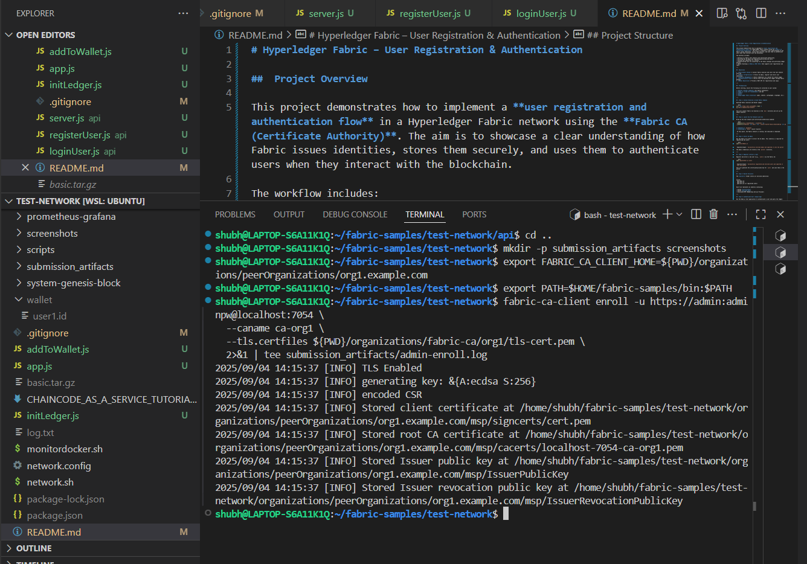
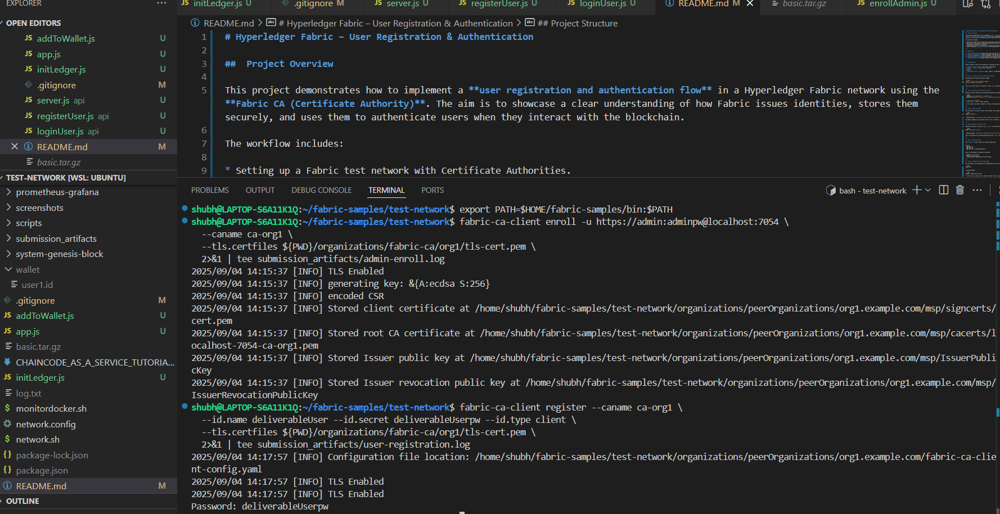
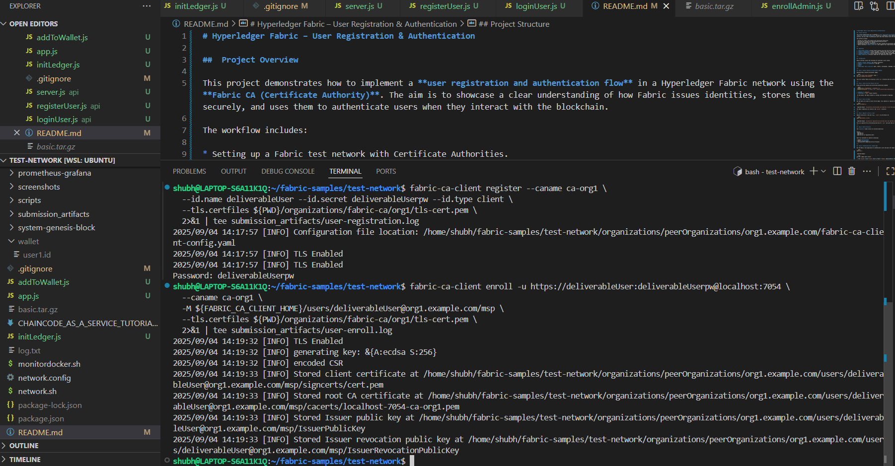
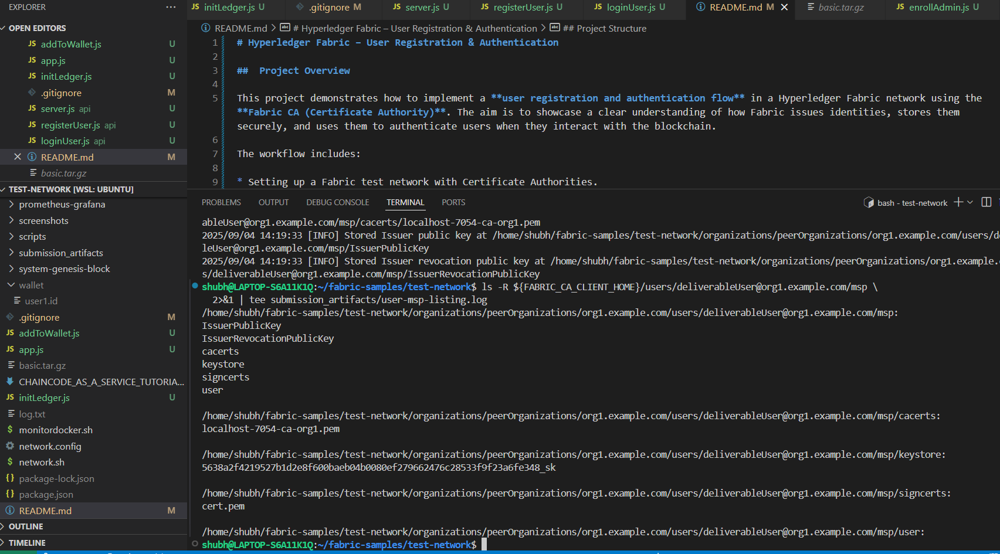
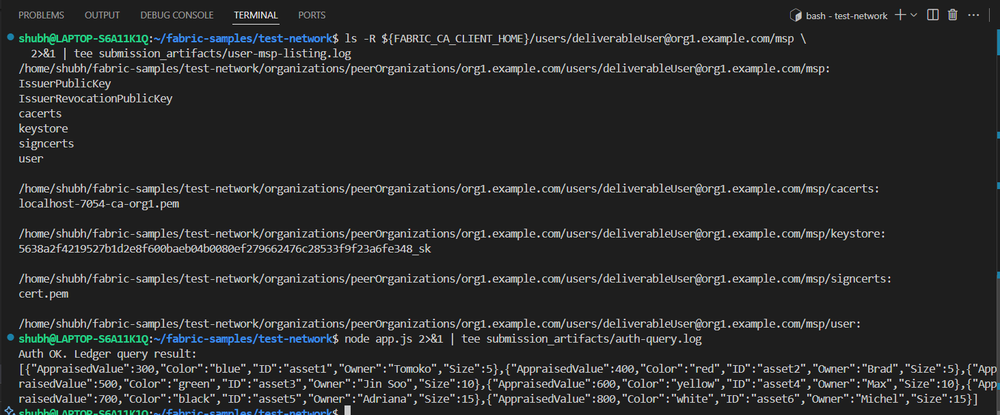

# Hyperledger Fabric – User Registration & Authentication

##  Project Overview

This project demonstrates how to implement a **user registration and authentication flow** in a Hyperledger Fabric network using the **Fabric CA (Certificate Authority)**. The aim is to showcase a clear understanding of how Fabric issues identities, stores them securely, and uses them to authenticate users when they interact with the blockchain.

The workflow includes:

* Setting up a Fabric test network with Certificate Authorities.
* Enrolling the CA admin and registering/enrolling new users.
* Storing user identities in a wallet.
* Authenticating users by connecting to the Fabric Gateway and performing ledger queries.
* (Bonus) Building a **Node.js REST API** that supports user registration and login.

---

##  Objectives

1. **Environment Setup** – Install Fabric binaries and start the test network with CAs.
2. **Fabric CA Operations** – Enroll CA admin, register and enroll user identities.
3. **Identity Management** – Store credentials in a wallet for secure usage.
4. **Authentication Flow** – Verify users by querying the ledger through Fabric Gateway.
5. **Bonus Objective** – Provide a REST API for registration and login.

---

##  Prerequisites

Before starting, ensure the following are installed on your system:

* **Docker & Docker Compose** (for Fabric containers)
* **Node.js (>=v18 LTS recommended)** and npm
* **cURL**
* **Git**
* **Hyperledger Fabric binaries** (peer, orderer, configtxgen, cryptogen, etc.)

---

##  Step 1: Install Binaries & Clone Fabric Samples

Download Fabric binaries and Docker images:

```bash
curl -sSL https://bit.ly/2ysbOFE | bash -s
cd fabric-samples/test-network
```

This will install Fabric CLI binaries in the `bin/` directory and set up the sample networks.

---

##  Step 2: Launch the Test Network with CAs

Bring up the test network with Certificate Authorities enabled:

```bash
./network.sh up createChannel -c mychannel -ca
./network.sh deployCC -ccn basic -ccp ../asset-transfer-basic/chaincode-go -ccl go
```

* **Channel:** `mychannel`
* **Chaincode:** `basic` (Asset Transfer)

 At this point, the Fabric network is running, and chaincode is deployed.

---

##  Step 3: Enroll CA Admin

Use the Fabric CA client to enroll the CA admin. This identity is required for registering new users.

```bash
node enrollAdmin.js
```

 Expected Output: `Successfully enrolled admin and imported it into the wallet`

The admin credentials are stored in the `wallet/` directory.

---

##  Step 4: Register & Enroll a User

Register and enroll a new user (e.g., `user1`) via the Fabric CA:

```bash
node registerUser.js user1
```

 Expected Output: `Successfully registered and enrolled user1 and imported it into the wallet`

This will generate the certificate/private key for `user1` and save them in the wallet.

---

##  Step 5: Wallet Structure

The **wallet/** folder stores all enrolled identities:

```
wallet/
 ├── admin.id
 ├── user1.id
 ├── user2.id (if registered later)
```

Each file represents an identity containing:

* User’s **certificate**
* User’s **private key**
* Associated MSP (Membership Service Provider)

---

##  Step 6: Authenticate User (Simple App)

Run the Node.js test application to authenticate a user and query the ledger:

```bash
node app.js
```

 Expected Output:

```json
Auth OK. Ledger query result:
[{"AppraisedValue":300,"Color":"blue","ID":"asset1","Owner":"Tomoko","Size":5},
 {"AppraisedValue":400,"Color":"red","ID":"asset2","Owner":"Brad","Size":5},
 {"AppraisedValue":500,"Color":"green","ID":"asset3","Owner":"Jin Soo","Size":10},
 {"AppraisedValue":600,"Color":"yellow","ID":"asset4","Owner":"Max","Size":10},
 {"AppraisedValue":700,"Color":"black","ID":"asset5","Owner":"Adriana","Size":15},
 {"AppraisedValue":800,"Color":"white","ID":"asset6","Owner":"Michel","Size":15}]

```

This confirms that the identity from the wallet is valid and can successfully interact with the blockchain.

---

##  Bonus: REST API for Registration & Login

We extended the project with a **Node.js Express API** to allow programmatic registration and login.

### Start the API Server

```bash
node server.js
```

 Output:

```
API server running at http://localhost:3000
```

### API Endpoints

**1. Register a New User**

```bash
curl -X POST http://localhost:3000/register \
  -H "Content-Type: application/json" \
  -d '{"username":"user2"}'
```

 Response:

```
User user2 registered and enrolled
```

**2. Login with Existing User**

```bash
curl -X POST http://localhost:3000/login \
  -H "Content-Type: application/json" \
  -d '{"username":"user2"}'
```

 Response:

```json
{
"message": "User user2 authenticated",
"ledger": [
{ "AppraisedValue": 300, "Color": "blue", "ID": "asset1", "Owner": "Tomoko", "Size": 5 },
{ "AppraisedValue": 400, "Color": "red", "ID": "asset2", "Owner": "Brad", "Size": 5 },
{ "AppraisedValue": 500, "Color": "green", "ID": "asset3", "Owner": "Jin Soo", "Size": 10 },
{ "AppraisedValue": 600, "Color": "yellow", "ID": "asset4", "Owner": "Max", "Size": 10 },
{ "AppraisedValue": 700, "Color": "black", "ID": "asset5", "Owner": "Adriana", "Size": 15 },
{ "AppraisedValue": 800, "Color": "white", "ID": "asset6", "Owner": "Michel", "Size": 15 }
]
}
```

Both existing and newly registered users can authenticate.

---

##  Project Structure

```
test-network/
 ├── enrollAdmin.js          # Enrolls the CA admin
 ├── registerUser.js         # Registers and enrolls new users
 ├── app.js                  # Simple test app to authenticate and query ledger
 ├── server.js               # REST API (if used at root level)
 ├── addToWallet.js          # Utility for adding identities to wallet
 ├── wallet/                 # Stores enrolled identities (e.g., user1.id)
 │    └── user1.id
 ├── connection-org1.json    # Connection profile for Org1
 ├── package.json            # Node.js dependencies (root app if any)
 ├── package-lock.json
 ├── api/                    # === Bonus section: REST API with user management ===
 │    ├── enrollAdmin.js     # Enrolls Org1 CA admin into api/wallet
 │    ├── registerUser.js    # Registers and enrolls new users
 │    ├── loginUser.js       # Authenticates users and queries ledger
 │    ├── server.js          # Express.js server exposing /register & /login
 │    ├── package.json
 │    ├── package-lock.json
 │    ├── wallet/            # Dedicated wallet for API users
 │    │    ├── admin.id
 │    │    ├── user1.id
 │    │    ├── user2.id
 │    │    ├── user3.id
 │    │    └── user4.id
 │    └── node_modules/
 └── submission_artifacts/   # Logs required for deliverables
      ├── admin-enroll.log
      ├── user-registration.log
      ├── user-enroll.log
      ├── user-msp-listing.log
      └── auth-query.log

```


---

## Deliverables

This section contains proof of successful user registration, enrollment, and authentication in our Hyperledger Fabric network.

---

### 1. CA Admin Enrollment
- **Log:** [admin-enroll.log](submission_artifacts/admin-enroll.log)  
- **Screenshot:**  
  

---

### 2. User Registration
- **Log:** [user-registration.log](submission_artifacts/user-registration.log)  
- **Screenshot:**  
  

---

### 3. User Enrollment
- **Log:** [user-enroll.log](submission_artifacts/user-enroll.log)  
- **Screenshot:**  
  

---

### 4. User MSP (Generated Certificates)
- **Log:** [user-msp-listing.log](submission_artifacts/user-msp-listing.log)  
- **Screenshot:**  
  

---

### 5. Authentication (Ledger Query)
- **Log:** [auth-query.log](submission_artifacts/auth-query.log)  
- **Screenshot:**  
  


##  References

* [Hyperledger Fabric Documentation](https://hyperledger-fabric.readthedocs.io/)
* [Fabric CA Documentation](https://hyperledger-fabric-ca.readthedocs.io/)
* [Hyperledger fabric-samples](https://github.com/hyperledger/fabric-samples)
